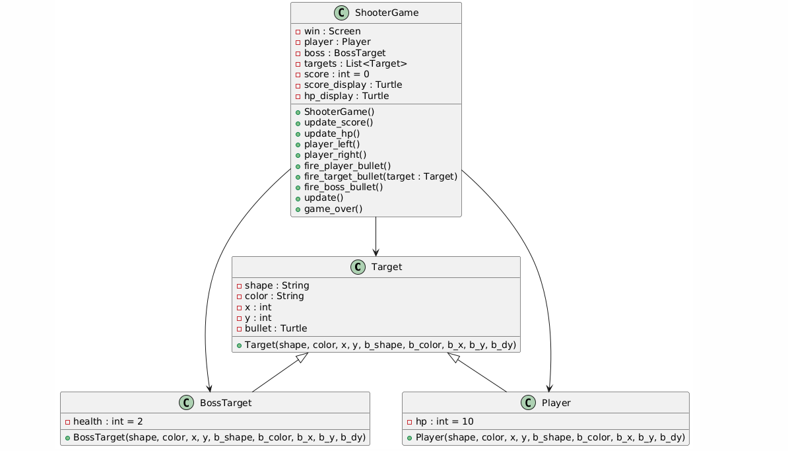

# **Triangle Shoot: A Python Shooting Game**

### Project Description:

Triangle Shoot is a simple 2D shooting game developed in Python. 

### Game Objective:

Players control a ship, aiming to shoot down enemy triangles while avoiding enemy fire and defeating a boss. 

### How to run:
Run the main_menu.py file in the directory and enjoy the game.

### Game Control:
Use the arrow keys (left and right) to move your ship and press the space bar to fire bullets. Aim to hit the enemy triangles while dodging their fire, defeat the boss to score as high as possible.

### Project Design and Implementation:

The project utilizes object-oriented programming with the following key classes:

**Target**: Base class for all in-game objects (player ship, enemies, boss) with properties like shape, color, position, and bullet management.

**BossTarget**: Inherits from Target representing the boss with higher health.

**Player**: Inherits from Target representing the player's ship.

**ShooterGame**: Main class managing game logic, including player movement, enemy and boss AI (if implemented), collision detection, score and health tracking, and game over conditions.

### Sophistication level 80-85
This project might not be as complicated as it could have been due to my own carelessness, for example adding the exploded effect when the boss died, and make it shoot out the bullet in all direction and add the bullet bouncing.
I think that if those features were to be implemented well, it would help me being more sastisfied with the result and rate it higher.

### Game DEMO and Presention
https://youtu.be/EqMKBMWzCcM

### UML Diagram

